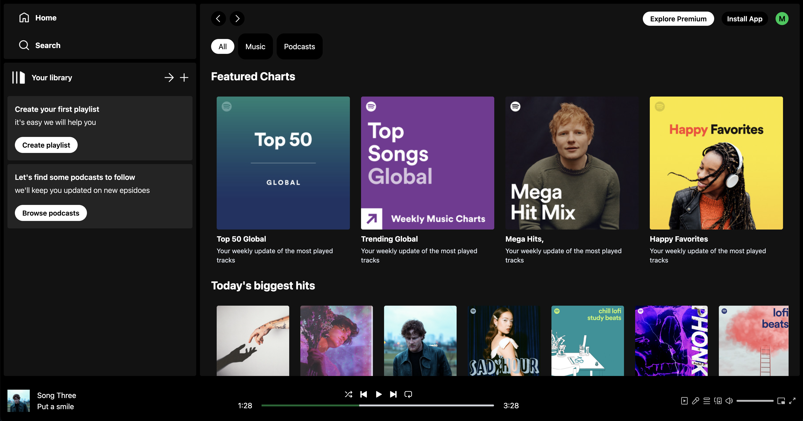

# Spotify - ReactJS

## 📷 Screenshot

  

  

## 📝 Project Description

The Spotify clone displays a list of songs from a predfined list. The song player is able to play/pause and seek the currently playing song.

## 📚 Technologies

- [ReactJS](https://reactjs.org/)
- [React Router](https://reactrouter.com/)
